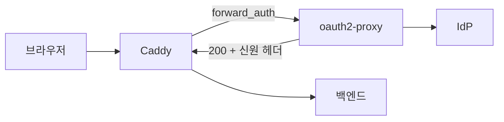

# OIDC 게이트

[🇺🇸 English](oidc.md) · [🇰🇷 한국어](oidc.ko.md)

## 뭘 하는 건가

백엔드 **앞에서** 인증을 끝내고, 통과한 요청에만 신원 헤더를 붙여 넘깁니다. 백엔드는 자기가 보호받고 있다는 걸 몰라도 됩니다.

쓰는 경우는 둘입니다.

* 백엔드에 로그인이 아예 없을 때 — MRTG, LibreNMS, 내부 대시보드 같은 것들
* 로그인이 있어도 프록시 단에서 먼저 막고 싶을 때 — 미인증 트래픽이 애플리케이션에 닿지 않습니다

## 구조



Caddy 가 매 요청마다 oauth2-proxy 의 `/oauth2/auth` 에 물어봅니다. 세션이 있으면 200 과 함께 `X-Auth-Request-Email` 같은 헤더가 돌아오고, 없으면 401 이 돌아와서 Caddy 가 로그인으로 리다이렉트합니다.

## 설정

```sh
cp oauth2-proxy/oidc.cfg.example oauth2-proxy/oidc.cfg
vi oauth2-proxy/oidc.cfg
vi .env                      # O2P_CLIENT_SECRET, O2P_COOKIE_SECRET
cp conf.d/inside.example.com.caddy.example conf.d/inside.example.com.caddy
vi conf.d/inside.example.com.caddy
docker compose --profile oidc up -d
```

`cookie_secret` 은 32바이트여야 합니다.

```sh
openssl rand -base64 32 | tr -- '+/' '-_'
```

시크릿은 `.cfg` 가 아니라 `.env` 에 넣습니다. 그래야 `.cfg` 를 커밋할 수 있습니다. compose 가 `environment:` 로 주입합니다.

> ⚠ compose 에서 `${O2P_CLIENT_SECRET:?...}` 를 쓰지 마세요. compose 는 프로필을 거르기 **전에** 파일 전체를 보간하므로, oidc 프로필을 켜지 않은 기본 `docker compose up -d` 까지 같이 죽습니다. 빈 시크릿은 oauth2-proxy 가 기동할 때 걸립니다.

## IdP 등록

IdP 포털에 redirect URI 를 등록해야 합니다. `oidc.cfg` 의 `redirect_url` 과 **한 글자라도 다르면** 로그인이 실패합니다.

```
https://inside.example.com/oauth2/callback
```

authentik, Keycloak, Google, 그 밖에 OIDC discovery 를 지원하는 곳이면 다 됩니다. `oidc_issuer_url` 뒤에 `/.well-known/openid-configuration` 을 붙여서 열리는지 먼저 확인하세요.

> ⚠ `/.well-known/*` 이 차단되지 않게 주의하세요. `probe-secret` 의 점파일 패턴에 걸리지 않도록 돼 있지만, 스니펫을 고칠 때 확인이 필요합니다.

## 사이트 쪽 설정

세 덩어리입니다.

```caddy
# ① oauth2-proxy 엔드포인트 — 항상 통과. 막히면 로그인 자체가 불가능해진다
handle /oauth2/* {
	reverse_proxy 127.0.0.1:4180
}

# ② 내부대역 → 무인증 통과
handle @internal {
	import log-internal
	reverse_proxy http://127.0.0.1:8080
}

# ③ 외부 → 인증 확인
handle {
	route {
		forward_auth 127.0.0.1:4180 {
			uri /oauth2/auth
			copy_headers X-Auth-Request-Email X-Auth-Request-User
			@unauth status 401
			handle_response @unauth {
				redir * /oauth2/start?rd={http.request.uri}
			}
		}
		import log-oidc
		reverse_proxy http://127.0.0.1:8080
	}
}
```

`route` 로 감싸는 이유는 순서 때문입니다. `forward_auth` 가 헤더를 붙인 **뒤에** `log-oidc` 가 실행돼야 `auth_email` 이 잡히는데, `handle` 만 쓰면 Caddy 가 재정렬해서 순서 보장이 깨집니다.

## 인증 후 추가 조건

인증만으로 부족하면 헤더를 보고 더 거르면 됩니다.

```caddy
import log-oidc

# 특정 도메인 이메일만 허용
@not_allowed not header_regexp X-Auth-Request-Email (?i)example\.com$
abort @not_allowed

reverse_proxy http://127.0.0.1:8080
```

경로마다 조건을 다르게 주는 것도 됩니다.

```caddy
# 관리 경로는 더 좁게
@admin_denied {
	path /admin/*
	not header_regexp X-Auth-Request-Email (?i)^(alice|bob)@example\.com$
}
abort @admin_denied
```

## 사이트가 여러 개일 때

한 oauth2-proxy 인스턴스로 여러 사이트를 보호할 수 있습니다. 다만 `redirect_url` 은 하나로 고정됩니다.

이때 `rd` 파라미터를 **절대 URL** 로 줘야 합니다.

```caddy
redir * /oauth2/start?rd=https://inside.example.com{http.request.uri}
```

상대경로로 주면 로그인 완료 후 `redirect_url` 에 적힌 호스트로 떨어집니다. 그리고 `oidc.cfg` 의 `whitelist_domains` 에 그 호스트가 있어야 합니다 — 없으면 oauth2-proxy 가 `/` 로 강등시킵니다.

```
whitelist_domains = [".example.com"]
```

## 브라우저가 아닌 클라이언트

**게이트를 통과할 수 없습니다.** 모바일 앱, REST API 클라이언트, 웹훅, 헬스체크 모니터는 OIDC 리다이렉트를 완주하지 못합니다.

증상은 대개 이렇습니다. 헬스체크가 `/oauth2/start` 로 무한 리다이렉트되면서 IdP 에 헛부하를 걸고, state 없는 콜백이 400 을 남깁니다.

해결은 대역이나 IP 로 예외를 주는 것입니다.

```caddy
# 헬스체크 모니터. 브라우저 인증 불가 클라이언트라 예외.
@healthcheck remote_ip 198.51.100.7/32
handle @healthcheck {
	import log-internal
	reverse_proxy http://127.0.0.1:8080
}
```

예외는 **그 사이트 파일에** 두세요. 공용 대역표(`00-acl.caddy`)에 넣으면 왜 그 IP가 통과하는지의 이유가 사라지고, 다른 사이트에도 조용히 구멍이 생깁니다.

백엔드가 자체 OIDC 를 지원한다면 그쪽으로 넘기는 게 근본 해결입니다. 같은 IdP 를 쓰면 세션이 공유돼서 사용자 입장에선 로그인이 한 번입니다.

## 알림 메일 안의 링크가 프록시를 두드린다

웹 프록시 문서에 메일이 나오는 게 뜬금없어 보이지만, 게이트 뒤에 **알림 메일을 보내는 앱**을 두면 반드시 만나는 문제입니다. 이슈트래커, 위키, 메신저가 전부 여기 해당합니다.

고리는 이렇습니다.

1. 게이트 뒤의 Jira 가 "댓글이 달렸습니다" 메일을 보냅니다. 본문에 `https://issues.example.com/browse/ABC-123` 이 들어갑니다.
2. 그 메일이 조직의 메일 보안 게이트웨이를 지납니다. 요즘 제품은 본문의 **URL 을 직접 열어보고** 피싱·멀웨어인지 판정합니다.
3. 검사기가 그 URL 을 엽니다. 그 요청이 이 프록시에 도착합니다.
4. OIDC 게이트에 걸립니다.

여기서 검사기는 브라우저가 아닙니다. `/oauth2/start` 리다이렉트는 따라가지만 쿠키를 들고 다니지 못하고 로그인 폼도 못 채웁니다. 그래서 **매번 IdP 로그인 화면(200)까지 갔다가 그대로 버립니다.** state 가 없거나 버려진 콜백은 400 으로 떨어집니다.

알림이 많은 앱일수록 누적이 큽니다. 이슈 댓글 하나에 메일이 수신자 수만큼 나가고, 메일 하나에 링크가 여러 개 들어 있으면 그 곱만큼 요청이 들어옵니다. 결과는 둘입니다 — IdP 에 아무 의미 없는 부하가 걸리고, **인증 실패 로그가 이걸로 덮여서 진짜 실패가 안 보입니다.**

> 백엔드 자체 로그인만 쓸 때는 이 문제가 없습니다. 검사기가 로그인 페이지 200 을 받고 거기서 끝나기 때문입니다. 리다이렉트 체인으로 바뀌는 OIDC 게이트에서만 생깁니다.

`badbots` 나 `probe-*` 로는 안 잡힙니다. 검사기는 UA 를 정상 브라우저로 위장하는 경우가 많고, 여는 경로도 메일에 실제로 들어 있던 정상 경로라 프로브가 아닙니다. **식별 가능한 건 발신 대역뿐입니다.**

### 끊는 법

```caddy
import gate-stub 198.51.100.0/24
```

헬스체크 예외와 달리 백엔드로 보내지 않고 **로그인 안내 HTML 200** 으로 끝냅니다. 검사기가 정상 상황에서 최종적으로 받는 것도 로그인 페이지의 200 이라, 그 종착점을 1홉으로 대체하는 셈입니다.

200 을 돌려주는 게 핵심입니다. 403 이나 타임아웃을 주면 검사기가 그 링크를 수상하다고 판정해서 **메일 자체에 경고를 붙이거나 격리할 수 있습니다.** 막는 게 아니라 "볼 것 없다"고 알려주고 보내는 쪽입니다.

> ⚠ `handle @internal` 보다 **먼저** import 하세요. 검사기 대역이 내부 대역표에 들어 있으면 무인증 통과로 빠져서 백엔드까지 들어갑니다.

차단이 아니라 정상 종결이라 `block_reason` 이 아니라 `auth=gate-stub` 으로 남습니다. 스니펫 자체에 대한 설명은 [스니펫 레퍼런스](snippets.ko.md#gate-stub) 문서에 있습니다.

### 발신 대역 찾기

`/oauth2/start` 만 반복하고 콜백을 완주하지 못하는 IP 가 후보입니다.

```sh
jq -r 'select(.request.uri | startswith("/oauth2/start")) | .request.client_ip' \
  logs/*/access.log | sort | uniq -c | sort -rn | head -20
```

사람이라면 로그인을 마치고 `auth=oidc` 가 붙은 요청이 뒤따릅니다. 그게 **한 번도 없는** IP 가 검사기입니다. 대역이 확인되면 메일 담당 쪽에 제품명을 물어보는 게 확실합니다 — UA 에 제품 이름이 그대로 들어 있는 경우도 많습니다.

## IdP 가 둘 이상일 때

사이트마다 IdP 가 다르면 oauth2-proxy 를 그만큼 띄우고 포트로 가릅니다. `network_mode: host` 라 포트만 겹치지 않으면 됩니다.

```yaml
oauth2-proxy-a:
  command: ["--config=/etc/oauth2-proxy/a.cfg"]   # :4180
oauth2-proxy-b:
  command: ["--config=/etc/oauth2-proxy/b.cfg"]   # :4181
```

사이트 파일은 자기 포트를 가리키면 됩니다.

```caddy
handle /oauth2/* {
	reverse_proxy 127.0.0.1:4181
}
```

같은 IdP 를 보는 사이트끼리는 인스턴스를 공유하세요. 세션 쿠키가 공유돼서 로그인이 한 번으로 끝납니다. 그때는 위의 "사이트가 여러 개일 때" 의 `rd` 절대 URL 규칙이 적용됩니다.

## 안 될 때

**로그인 후 엉뚱한 호스트로 떨어진다** — `rd` 가 상대경로입니다. 절대 URL 로 바꾸고 `whitelist_domains` 를 확인하세요.

**무한 리다이렉트** — `/oauth2/*` 가 통과되고 있는지 확인하세요. 차단 스니펫이 먼저 잡고 있을 수 있습니다.

**`auth_email` 이 빈 값** — `log-oidc` 가 `route` 밖에 있거나 `forward_auth` 앞에 있습니다.

**미인증 요청에 `auth` 필드가 아예 없다** — 정상입니다. 401 을 받아 리다이렉트하는 시점에 핸들러 체인이 끝나서 `log_append` 까지 오지 못합니다.

**IdP 가 redirect URI 불일치를 말한다** — `oidc.cfg` 의 `redirect_url` 과 포털 등록값을 한 글자씩 비교하세요. 끝의 `/` 하나도 다르면 안 됩니다.
