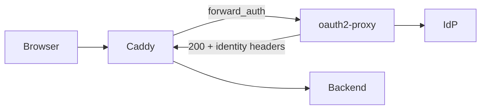

# OIDC gate

[🇺🇸 English](oidc.md) · [🇰🇷 한국어](oidc.ko.md)

## What it does

Authentication finishes **in front of** the backend, and only requests that got through are forwarded, carrying identity headers. The backend never has to know it is protected.

Two situations call for it.

* The backend has no login at all — MRTG, LibreNMS, an internal dashboard
* It has one, but you want unauthenticated traffic stopped before it reaches the application

## Shape



Caddy asks oauth2-proxy's `/oauth2/auth` on every request. With a session, 200 comes back along with headers like `X-Auth-Request-Email`; without one, 401 comes back and Caddy redirects to login.

## Setting it up

```sh
cp oauth2-proxy/oidc.cfg.example oauth2-proxy/oidc.cfg
vi oauth2-proxy/oidc.cfg
vi .env                      # O2P_CLIENT_SECRET, O2P_COOKIE_SECRET
cp conf.d/inside.example.com.caddy.example conf.d/inside.example.com.caddy
vi conf.d/inside.example.com.caddy
docker compose --profile oidc up -d
```

`cookie_secret` has to be 32 bytes.

```sh
openssl rand -base64 32 | tr -- '+/' '-_'
```

Secrets go in `.env`, not in `.cfg`, which is what makes the `.cfg` committable. Compose injects them through `environment:`.

> ⚠ Do not use `${O2P_CLIENT_SECRET:?...}` in compose. Compose interpolates the whole file **before** it filters profiles, so a plain `docker compose up -d` without the oidc profile dies too. An empty secret is caught when oauth2-proxy starts.

## Registering with the IdP

The redirect URI has to be registered in the IdP's console. **One character of difference** from `redirect_url` in `oidc.cfg` and login fails.

```
https://inside.example.com/oauth2/callback
```

authentik, Keycloak, Google, anything that supports OIDC discovery will do. Append `/.well-known/openid-configuration` to `oidc_issuer_url` and confirm it opens before anything else.

> ⚠ Make sure `/.well-known/*` is not blocked. It is kept clear of `probe-secret`'s dotfile patterns, but check whenever you touch a snippet.

## On the site side

Three pieces.

```caddy
# ① the oauth2-proxy endpoints — always pass. Block these and login is impossible
handle /oauth2/* {
	reverse_proxy 127.0.0.1:4180
}

# ② internal ranges → through, unauthenticated
handle @internal {
	import log-internal
	reverse_proxy http://127.0.0.1:8080
}

# ③ everyone else → check authentication
handle {
	route {
		forward_auth 127.0.0.1:4180 {
			uri /oauth2/auth
			copy_headers X-Auth-Request-Email X-Auth-Request-User
			@unauth status 401
			handle_response @unauth {
				redir * /oauth2/start?rd={http.request.uri}
			}
		}
		import log-oidc
		reverse_proxy http://127.0.0.1:8080
	}
}
```

The `route` wrapper is there for ordering. `log-oidc` only captures `auth_email` if it runs **after** `forward_auth` has attached the headers, and with `handle` alone Caddy reorders and that guarantee is gone.

## Narrowing further after authentication

When being logged in is not enough, filter on the headers.

```caddy
import log-oidc

# only addresses in one domain
@not_allowed not header_regexp X-Auth-Request-Email (?i)example\.com$
abort @not_allowed

reverse_proxy http://127.0.0.1:8080
```

Different conditions per path work too.

```caddy
# tighter on the admin paths
@admin_denied {
	path /admin/*
	not header_regexp X-Auth-Request-Email (?i)^(alice|bob)@example\.com$
}
abort @admin_denied
```

## More than one site

One oauth2-proxy instance can protect several sites. `redirect_url`, however, is fixed to a single value.

That makes the `rd` parameter an **absolute URL**.

```caddy
redir * /oauth2/start?rd=https://inside.example.com{http.request.uri}
```

Give it a relative path and the user lands on whatever host `redirect_url` names once login finishes. The host also has to appear in `whitelist_domains` in `oidc.cfg` — without it, oauth2-proxy downgrades the destination to `/`.

```
whitelist_domains = [".example.com"]
```

## Clients that are not browsers

**They cannot get through the gate.** Mobile apps, REST API clients, webhooks and health-check monitors never complete the OIDC redirect.

The symptom is usually this: a health check redirects to `/oauth2/start` forever, loading the IdP for nothing, while callbacks with no state leave 400s behind.

The fix is an exception by range or address.

```caddy
# Health-check monitor. Cannot do browser auth, so it is exempt.
@healthcheck remote_ip 198.51.100.7/32
handle @healthcheck {
	import log-internal
	reverse_proxy http://127.0.0.1:8080
}
```

Keep the exception **in that site's file**. Put it in the shared range list (`00-acl.caddy`) and the reason that address is allowed disappears, while other sites quietly gain a hole.

If the backend speaks OIDC itself, handing authentication to it is the real fix. Point it at the same IdP and the session is shared, so the user still logs in once.

## Notification mail links knocking on the proxy

Mail in a reverse-proxy document looks like a non sequitur, but put an application that **sends notification mail** behind the gate and you will meet this. Issue trackers, wikis and chat servers all qualify.

The chain runs like this.

1. Jira, behind the gate, sends "someone commented". The body contains `https://issues.example.com/browse/ABC-123`.
2. That mail passes through your organisation's mail security gateway. Modern ones **open the URLs in the body** to decide whether they are phishing or malware.
3. The checker opens that URL. The request arrives here.
4. The OIDC gate catches it.

The checker is not a browser. It follows the `/oauth2/start` redirect but carries no cookies and fills in no login form, so **it walks to the IdP login page (200) every time and drops it there**. A callback with no state, or one that is abandoned, comes back as 400.

The more notifications an application sends, the more this accumulates. One issue comment produces one mail per recipient, and one mail can carry several links, so requests arrive as the product of the two. Two things follow: the IdP takes load that means nothing, and **real authentication failures get buried under this**.

> A backend using only its own login never has this problem. The checker receives the login page's 200 and stops. It only appears once the flow becomes a redirect chain behind an OIDC gate.

`badbots` and `probe-*` will not catch it. These checkers usually present an ordinary browser UA, and the path they open is a real one that was genuinely in the mail, so it is no probe. **The source range is the only thing that identifies them.**

### Cutting it off

```caddy
import gate-stub 198.51.100.0/24
```

Unlike a health-check exception, this never reaches the backend. It ends with **an HTML 200 saying login is required**. In the normal case the checker also ends up receiving a login page's 200, so this replaces that endpoint in a single hop.

Answering 200 is the point. A 403 or a timeout can make the checker judge the link suspicious and **attach a warning to the mail, or quarantine it**. This is not blocking; it is telling the checker there is nothing to see and sending it on its way.

> ⚠ Import it **before** `handle @internal`. If the checker's range happens to be in your internal table, it slips through unauthenticated and reaches the backend instead.

Since this is a clean termination rather than a block, it records `auth=gate-stub` rather than a `block_reason`. The snippet itself is described in [Snippet reference](snippets.md#gate-stub).

### Finding the source range

Candidates are addresses that keep hitting `/oauth2/start` and never complete a callback.

```sh
jq -r 'select(.request.uri | startswith("/oauth2/start")) | .request.client_ip' \
  logs/*/access.log | sort | uniq -c | sort -rn | head -20
```

A person finishes logging in, and requests tagged `auth=oidc` follow. An address where that **never once** happens is a checker. Once you have the range, asking whoever runs mail which product it is settles it — the name is often right there in the UA.

## More than one IdP

When sites use different IdPs, run that many oauth2-proxy instances and separate them by port. On `network_mode: host`, not colliding on ports is all that is required.

```yaml
oauth2-proxy-a:
  command: ["--config=/etc/oauth2-proxy/a.cfg"]   # :4180
oauth2-proxy-b:
  command: ["--config=/etc/oauth2-proxy/b.cfg"]   # :4181
```

Each site file points at its own port.

```caddy
handle /oauth2/* {
	reverse_proxy 127.0.0.1:4181
}
```

Sites that share an IdP should share the instance: the session cookie is shared, so people log in once. That is when the absolute-URL `rd` rule from "More than one site" above applies.

## When it does not work

**Landing on the wrong host after login** — `rd` is a relative path. Make it absolute and check `whitelist_domains`.

**Redirect loop** — check that `/oauth2/*` is getting through. A blocking snippet may be matching first.

**`auth_email` is empty** — `log-oidc` is outside the `route`, or ahead of `forward_auth`.

**Unauthenticated requests have no `auth` field at all** — that is correct. The handler chain ends at the 401 redirect, before `log_append` is reached.

**The IdP reports a redirect URI mismatch** — compare `redirect_url` in `oidc.cfg` against the registered value character by character. A single trailing `/` is enough to break it.
